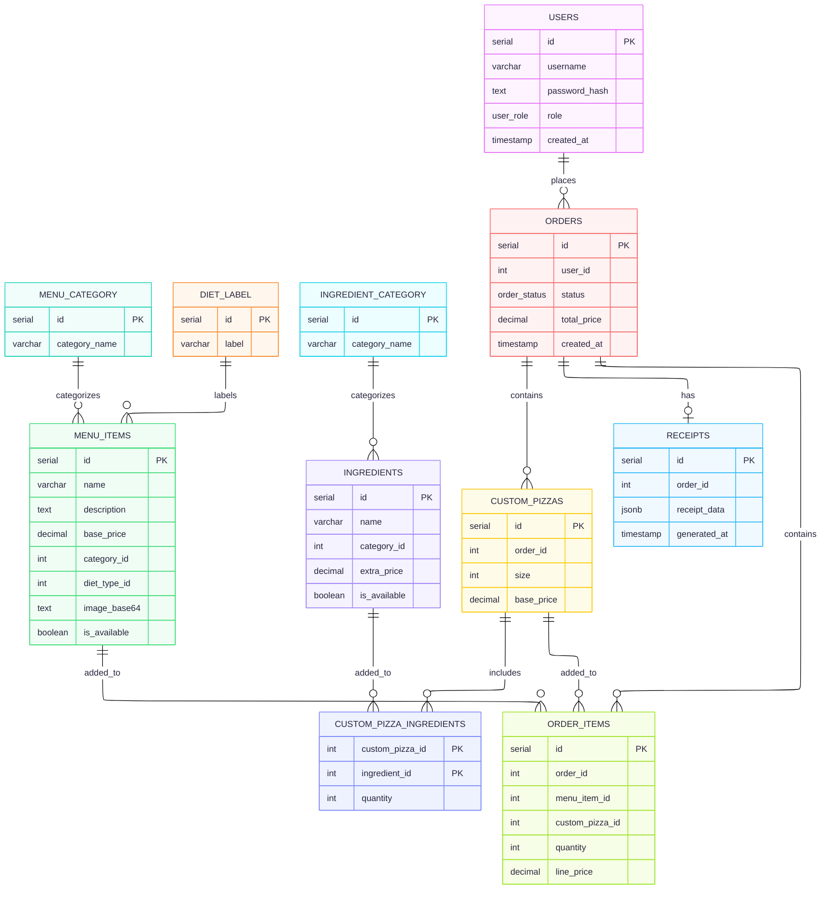

# Ravintola Restaurant Management Ecosystem

Welcome to the **Ravintola (Restaurant)** ecosystem! This repository documents a modern, production-ready, full-stack solution featuring a feature-rich customer-facing **Android mobile application**, a robust and secure **Express + Node.js backend server**, and a cloud-hosted **PostgreSQL database**. 

The entire system is integrated to deliver a cohesive experience for customers (ordering standard items and custom-built pizzas) and restaurant personnel (managing menus, orders, and receipts with analytics).

---

## The Android Client (`RavintolaApp`)

`RavintolaApp` is a native Android application built with **Java** and **Material Design 3 (M3)**. It serves as the primary touchpoint for customers, providing a highly intuitive and visually responsive mobile ordering experience.

### Key Mobile Features
*   **Secure User Management**: Token-based authentication using locally secured JWTs (via a custom `TokenManager`). Supports secure user registration, persistent login sessions, and profile tracking.
*   **Intuitive Menu Discovery**: Customers can browse food categories (e.g., Pizzas, Drinks, Sides) and filter items on-the-fly using diet labels (e.g., Vegan, Gluten-Free). Detailed menu cards display descriptions, prices, and high-quality images.
*   **Interactive Custom Pizza Builder**: A specialized interface that allows customers to construct their perfect pizza. They can choose their size (8", 10", 12") and check/uncheck available ingredients (sauces, cheeses, meats, veggies). The app dynamically updates pricing in real-time as toppings are added.
*   **Robust Ordering & Cart Systems**: Persistent local shopping cart allowing item quantity modifications. The checkout system submits orders securely to the backend and provides real-time order history tracking with detailed receipts.

### Android Tech Stack & Libraries
*   **Architecture**: Fragment-based modular architecture using the modern **Jetpack Navigation Component**.
*   **Networking**: [Retrofit 2](https://square.github.io/retrofit/) & [OkHttp 3](https://square.github.io/okhttp/) for asynchronous API communication.
*   **Image Caching**: [Glide](https://github.com/bumptech/glide) for high-performance base64 and web image rendering.
*   **JSON Serialization**: [GSON](https://github.com/google/gson) for typed model conversion.
*   **UI Components**: `BottomNavigationView`, `RecyclerView` (with customized item adapters), and dynamic `CardView` and `MaterialButton` widgets.

---

## The Backend Server (`ravintola/server`)

The backend is a robust **RESTful API** built on **Express.js** and **Node.js**. It implements a clean **Router-Controller-Model-Middleware** architecture to cleanly separate concerns. see the source code of the backend from this [repository](https://github.com/LordMahi19/ravintola-server)

### Server Architecture Flow

```
Client Request (Mobile / Dashboard)
       │
       ▼
  Middlewares (CORS, Morgan Logging, JSON Parsing)
       │
       ▼
  Router Layer (Routes requests based on endpoints)
       │
       ▼
  Auth & RBAC Middlewares (Verifies JWT and enforces Role-Based Access)
       │
       ▼
  Controller Layer (Validates input, coordinates operations, error handling)
       │
       ▼
  Model Layer (Runs SQL queries using PG connection pool)
       │
       ▼
  Database (Neon serverless PostgreSQL)
```

### Core Middlewares
1.  **Authentication Middleware (`authMiddleware.js`)**:
    *   `authenticate`: Extract and verify the Bearer token from the `Authorization` header using `jsonwebtoken`. If verified, binds the user payload `{ id, username, role }` to the `req.user` object. Rejects with `401 Unauthorized` if absent or expired.
    *   `optionalAuth`: Decodes and binds the user token if present, but permits anonymous guests to proceed (essential for guest checkout flows).
2.  **Role-Based Access Control Middleware (`rbacMiddleware.js`)**:
    *   `authorize(...allowedRoles)`: Protects staff and admin endpoints by evaluating `req.user.role`. Rejects with `403 Forbidden` if the user's role is not within the authorized boundaries (e.g., only `admin` can view daily sales analytics).

---

## Relational Database (Neon PostgreSQL)

The backend utilizes **PostgreSQL**, hosted on **Neon**—a modern serverless PostgreSQL database. It employs strict types, explicit foreign keys, cascading deletions, and conditional check constraints to guarantee database integrity.

### Entity-Relationship Diagram (ERD)



### Core Database Constraints & Design
*   **Enums**: `user_role` (`'customer'`, `'staff'`, `'admin'`) and `order_status` (`'pending'`, `'processing'`, `'completed'`) enforce value constraints at the DB layer.
*   **Custom Pizza Design**: A custom-made pizza is stored in `custom_pizzas` and associated with its selected ingredients in `custom_pizza_ingredients`.
*   **Strict Item Integrity (`chk_item_type`)**: The `order_items` table contains a custom constraint that guarantees a line item represents *either* a standard menu item *or* a custom pizza, never both and never neither:
    ```sql
    CONSTRAINT chk_item_type CHECK (
        (menu_item_id IS NOT NULL AND custom_pizza_id IS NULL) OR 
        (menu_item_id IS NULL AND custom_pizza_id IS NOT NULL)
    )
    ```
*   **Receipt Snapshotting**: Stored in the `receipts` table. It captures a read-only `JSONB` snapshot of the complete order representation (including standard menu items, customized pizzas, resolved ingredient names, size configurations, and pricing totals) the moment an order transitions to `'completed'`. This avoids pricing history issues if menu prices change later.

---

## RESTful API Reference

All requests and responses use JSON formatting. The backend API is hosted at: **`https://ravintola-server.onrender.com/`**

### Authentication (`/api/users`)

| Method | Endpoint | Auth | Description | Payload Example |
| :--- | :--- | :--- | :--- | :--- |
| **POST** | `/api/users/register` | Public | Register a new user account | `{"username": "johndoe", "password": "secure123"}` |
| **POST** | `/api/users/login` | Public | Login and receive an access token | `{"username": "johndoe", "password": "secure123"}` |
| **GET** | `/api/users/profile` | `customer`+ | Retrieve profile info of authenticated user | *None (Sends Bearer token)* |
| **GET** | `/api/users/users` | `staff`/`admin` | Retrieve a list of all registered users | *None (Sends Bearer token)* |
| **PUT** | `/api/users/:id/role` | `admin` | Promote/demote a user's permission | `{"role": "staff"}` |
| **DELETE** | `/api/users/:id` | `admin` | Delete a user account | *None (Sends Bearer token)* |

---

### Menu & Metadata Management (`/api/menu`, `/api/menu-categories`, `/api/diet-labels`)

| Method | Endpoint | Auth | Description | Query Parameters |
| :--- | :--- | :--- | :--- | :--- |
| **GET** | `/api/menu` | Public | Retrieve active menu items | `category` (Category Name), `diet` (Diet Label) |
| **GET** | `/api/menu/:id` | Public | Retrieve a specific menu item by ID | *None* |
| **POST** | `/api/menu` | `staff`/`admin` | Create a new menu item | *None (Takes name, price, category_id, etc.)* |
| **PUT** | `/api/menu/:id` | `staff`/`admin` | Update a menu item's attributes | *None* |
| **PATCH** | `/api/menu/:id/toggle`| `staff`/`admin` | Toggle availability status (`is_available`)*None* |
| **DELETE** | `/api/menu/:id` | `staff`/`admin` | Delete a menu item from the records | *None* |
| **GET** | `/api/menu-categories`| Public | Fetch available menu categories | *None* |
| **GET** | `/api/diet-labels` | Public | Fetch available diet classification labels | *None* |

---

### Pizza Ingredients Management (`/api/ingredients`, `/api/ingredient-categories`)

| Method | Endpoint | Auth | Description | Query / Details |
| :--- | :--- | :--- | :--- | :--- |
| **GET** | `/api/ingredients` | Public | Get all active custom ingredients | `category` (Filter ingredients by category) |
| **GET** | `/api/ingredients/:id` | Public | Get ingredient by ID | *None* |
| **GET** | `/api/ingredients/admin/all` | `staff`/`admin` | Get all ingredients (incl. unavailable) | *None* |
| **POST** | `/api/ingredients` | `staff`/`admin` | Add a new pizza ingredient | `{"name": "Bacon", "category_id": 3, "extra_price": 1.50}` |
| **PUT** | `/api/ingredients/:id`| `staff`/`admin` | Modify an existing ingredient | `{"name": "Bacon", "category_id": 3, "extra_price": 1.80}` |
| **PATCH** | `/api/ingredients/:id/toggle` | `staff`/`admin` | Enable or disable custom ingredient | *None* |
| **DELETE**| `/api/ingredients/:id`| `staff`/`admin` | Remove an ingredient permanently | *None* |

---

### Orders & Receipts (`/api/orders`, `/api/receipts`)

#### Placing an Order (`POST /api/orders`)
Enables guest checkouts (token optional) and authenticated user checkouts. Pricing is verified and calculated securely on the server to prevent malicious client manipulation.

##### Request Payload Format:
```json
{
  "items": [
    {
      "menu_item_id": 4,
      "quantity": 2
    },
    {
      "custom_pizza": {
        "size": 12,
        "ingredients": [
          { "ingredient_id": 1, "quantity": 1 },
          { "ingredient_id": 5, "quantity": 2 }
        ]
      }
    }
  ]
}
```

#### Order Endpoints Table:
| Method | Endpoint | Auth | Description | Query Parameters |
| :--- | :--- | :--- | :--- | :--- |
| **POST** | `/api/orders` | Public/Guest | Place a new order (calculates pricing on server) | *None* |
| **GET** | `/api/orders/mine` | Authenticated | Retrieve orders placed by the current user | *None* |
| **GET** | `/api/orders/all` | `staff`/`admin` | Get all restaurant orders | `status` (pending / processing / completed) |
| **GET** | `/api/orders/:id` | Self/Staff | Fetch detailed order summary | *None* |
| **PATCH** | `/api/orders/:id/status`| `staff`/`admin` | Advance status. Auto-generates receipt on `'completed'` | `{"status": "completed"}` |
| **GET** | `/api/receipts` | `admin` | Fetch historical receipt snapshots | *None* |
| **GET** | `/api/receipts/order/:orderId` | `staff`/`admin` | Fetch static receipt snapshot of an order | *None* |

---

### Business Analytics (`/api/analytics`)
*Authorized strictly for Admin users.*

*   **`GET /api/analytics/sales/daily`**: Fetch order count and total earnings aggregated daily.
*   **`GET /api/analytics/sales/monthly`**: Fetch order count and total earnings aggregated monthly.
*   **`GET /api/analytics/sales/yearly`**: Fetch order count and total earnings aggregated yearly.
*   **`GET /api/analytics/top-items`**: Find top-selling menu items ordered by total sold volume. (Optional query parameter: `?limit=N`).
*   **`GET /api/analytics/status-counts`**: Summarize total orders distributed among active statuses (`pending`, `processing`, `completed`).

---

## Cloud Hosting & Live Integration

The entire backend and data layers are hosted on state-of-the-art cloud platforms, removing the need for local development databases during mobile development.

### 1. Database Creation (Neon)
*   **Platform**: [Neon Serverless PostgreSQL](https://neon.tech/)
*   **Setup**:
    *   Provisioned a serverless database instance in the European region.
    *   Applied the initial database relational structure, enums, tables, and constraints by running `schema.sql`.
    *   Configured a secure connection string with built-in SSL pooling rules to handle elastic scale.

### 2. Server Deployment (Render)
*   **Platform**: [Render](https://render.com/) Web Services
*   **Configuration**:
    *   Linked the repository containing the `/server` directory to a Render Web Service.
    *   **Environment Variables** configured in the Render Dashboard:
        *   `PORT` = `10000` (Assigned dynamically, defaulting code uses `5000` locally)
        *   `DATABASE_URL` = `postgresql://ravintola_owner:...sslmode=require` (The Neon SQL connection string)
        *   `JWT_SECRET` = `[SuperSecretCryptographicKeyUsedToSignTokens]`
    *   **Health Check Endpoint**: Root path (`/`) returns `{ "message": "Welcome to the Ravintola Restaurant API" }` as a live server indicator.
    *   Live Server URL: **`https://ravintola-server.onrender.com/`**

### 3. Native App Consumption
*   Within the Android Client, `ApiClient` directs retrofitted REST requests directly to the hosted server instance:
    ```java
    // file: com.example.ravintolaapp.network.ApiClient
    public class ApiClient {
        private static final String BASE_URL = "https://ravintola-server.onrender.com/";
        private static Retrofit retrofit = null;
        
        public static Retrofit getClient() {
            if (retrofit == null) {
                // Configured with OkHttpClient, Token Interceptors, and GSON
                retrofit = new Retrofit.Builder()
                        .baseUrl(BASE_URL)
                        .client(getOkHttpClient())
                        .addConverterFactory(GsonConverterFactory.create())
                        .build();
            }
            return retrofit;
        }
    }
    ```
*   This connection string routes all requests from the native Android client straight to the Render API, which manages logic, authenticates JWTs, and updates data in real-time on the Neon cloud database.

---

## Step-by-Step System Setup

1.  **Clone the Repo**:
    ```bash
    git clone https://github.com/LordMahi19/ravintola-android.git
    ```
2.  **Open Project**:
    Launch **Android Studio** and click **Open**, selecting the `RavintolaApp` directory as the root.
3.  **Sync Gradle**:
    Wait for Android Studio to resolve the dependencies configured in `build.gradle.kts` (Retrofit, Glide, Gson, and Material UI packages).
4.  **Verify API URL**:
    Verify that `com.example.ravintolaapp.network.ApiClient` is pointing to the cloud server:
    `"https://ravintola-server.onrender.com/"`. If running a local server on your computer, configure Retrofit to use your machine's local IP or standard emulator loopback `10.0.2.2:5000`.
5.  **Deploy**:
    Run the application on an Android Virtual Device (AVD Emulator) or connect a physical device via USB debugging. Requires **API Level 24+ (Android 7.0 Nougat)**.

---